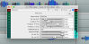
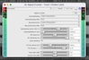

# chokehold JSFX
This page is an index of all my currently published JSFX plugins, including screenshots and short descriptions. 
[<< Back to ReadMe](./README.md)
 
 

## Categories
[Clipper](#clipper) 
[Distortion](#distortion) 
[Dynamics](#dynamics) 
[Equalizer](#equalizer) 
[Filter](#filter) 
[FX](#fx) 
[Generator](#generator) 
[Instrument FX](#instrument-fx) 
[Lo-Fi](#lo-fi) 
[Metering](#metering) 
[MIDI](#midi) 
[Noise](#noise) 
[Stereo](#stereo) 
[Utility](#utility) 

&nbsp;

## Clipper
| Screenshot | Plugin | Description |
| ---------- | ------ | ----------- |
|  | [Hard Clipper](./Clipper/hard_clipper.jsfx) | Simple and effective, chops away peaks above an adjustable ceiling volume, call it cold transistor distortion if you must. |
|  | [Knee Clipper](./Clipper/knee_clipper.jsfx) | A clipper neither purely hard nor purely soft, and yet a unification of both. |
|  | [Sine Clipper](./Clipper/sine_clipper.jsfx) | A clipper that uses the smoothness of the sine wave to tame loud signal peaks. |
|  | [Soft Clipper](./Clipper/soft_clipper.jsfx) | Increasingly lowers signal peaks the closer they get to an adjustable ceiling volume, call it warm tube overdrive if you must. Has up to 16x oversampling, DC blocker and optional final (non oversampled) hard clipping stage for true 0 dBfs output. |
|  | [Staging Clipper](./Clipper/staging_clipper.jsfx) | A clipper that automatically compensates for the ceiling, useful for leveling. |
 

## Distortion
| Screenshot | Plugin | Description |
| ---------- | ------ | ----------- |
|  | [Foldback Distortion](./Distortion/foldback_distortion.jsfx) | Folds waves between 0 and an adjustable ceiling, very harsh and nasty distortion. |
 

## Dynamics
| Screenshot | Plugin | Description |
| ---------- | ------ | ----------- |
|  | [Bus Comp](./Dynamics/bus_comp.jsfx) | Submix bus oriented compressor with automatic/program-dependent release, fadeable stereo linking, Mid/Side mode, external sidechain input with high pass filter, instability noise, dynamic saturation, optional output hard clipping and dry/wet mix for parallel compression. |
|  | [Consolidator](./Dynamics/consolidator.jsfx) | A set of 3 compressors with sidechain filter and stereo linking chained in a row, each with its own character. Has a dry/wet mix parameter for instant parallel/NY compression and Mid/Side mode. |
|  | [Gate/Expander](./Dynamics/gate_expander.jsfx) | Several channel routings, external sidechain, sidechain filter, fadeable stereo linking, hysteresis, and it can be switched between gate (fades to silence) and expander (fades to defined volume) modes. |
|  | [Track Comp](./Dynamics/track_comp.jsfx) | A low-CPU and ultra-flexible compressor, with everything from peak/RMS detection over feed-forward/-back modes, stereo linking and channel setups to automatic gain compensation and dynamic saturation. |
 

## Equalizer
| Screenshot | Plugin | Description |
| ---------- | ------ | ----------- |
|  | [EQ 560](./Equalizer/eq_560.jsfx) | Classic American 10-band graphic console equalizer. Limited flexibility, fast and streamlined workflow. Uses 2x oversampling for accurate high frequency filter curves, adds some character. |
 

## Filter
| Screenshot | Plugin | Description |
| ---------- | ------ | ----------- |
|  No UI | [DC Filter](./Filter/dc_filter.jsfx) | Multi-channel capable and extremely narrow DC offset removal filter. |
 

## FX
| Screenshot | Plugin | Description |
| ---------- | ------ | ----------- |
|  | [Filthy Delay](./FX/filthy_delay.jsfx) | Stereo delay with multiple routings (currently: stereo, inverted, ping-pong, mono), plus optional filters, boostable saturation and downsampling degradation in the feedback path. |
|  | [Ring Mod](./FX/ring_mod.jsfx) | Multiplies the input signal with a carrier signal, which can lead to all sorts of warbly modulation and distortion effects. |
 

## Generator
| Screenshot | Plugin | Description |
| ---------- | ------ | ----------- |
|  | [Test Signals](./Generator/test_signals.jsfx) | A collection of 13 different test tone and noise generators in one plugin, 14 if you count silence. Can have a different generator on each channel, can output both or just one channel, can sum both channels. |
 

## Instrument FX
| Screenshot | Plugin | Description |
| ---------- | ------ | ----------- |
|  | [Amp Sim](./Instrument%20FX/amp_sim.jsfx) | Guitar and bass amplifier with up to 16x oversampling, mono/stereo routings, pre/post/triggered noise gate, booster pedal function, interactive inter-stage EQ bands, dynamic Depth and Presence bands, and maximizer. |
|  | [Bass Squeezer](./Instrument%20FX/bass_squeezer.jsfx) | Split-band compression and filtered distortion for that instant bathtub bass sound. |
|  | [Cabinet Sim](./Instrument%20FX/cabinet_sim.jsfx) | Simple cabinet sim with 5 burnt-in impulse responses, 4 for guitar and 1 for bass. Can **not** load IRs from file. |
|  | [Chug Thug](./Instrument%20FX/chug_thug.jsfx) | Simplified split-band processor to tame the low end of distorted guitars when palm muting. |
|  | [Mic Combiner](./Instrument%20FX/mic_combiner.jsfx) | Utility to facilitate the process of merging two mono microphone signals into one. Processes each microphone signal individually, allows to set a balance/mix between both microphones, and sums them to mono. Can adjust timing between signals. |
 

## Lo-Fi
| Screenshot | Plugin | Description |
| ---------- | ------ | ----------- |
|  | [Signal Crusher](./Lo-Fi/signal_crusher.jsfx) | Sample rate changes, lost sample reconstruction, bit truncation, bit dithering... it's all in here. |
|  | [Telephone](./Lo-Fi/telephone.jsfx) | Makes vocals sound like they're coming through a phone receiver, also worth slamming on drums. |
 

## Metering
| Screenshot | Plugin | Description |
| ---------- | ------ | ----------- |
|  | [Correlation Meter](./Metering/correlation_meter.jsfx) | Inspect your song's stereo phase balance and find mono-problematic areas by watching an indicator go red. |
|  | [Phase Scope](./Metering/phase_scope.jsfx) | Visualizes the stereo field of a signal, also commonly known as Goniometer, Vector Scope or Lissajous. Selectable visualization colour and optional freeze-on-pause function. |
|  | [Stereo Checker](./Metering/stereo_checker.jsfx) | Displays the inter-channel relation of a two-channel input signal. |
|  | [Wave Scope](./Metering/wave_scope.jsfx) | Waveform display that can visualize various mono/stereo channel streams as Decibels, signed or absolute samples. With fadeable colours and freeze-on-pause function. |
 

## MIDI
| Screenshot | Plugin | Description |
| ---------- | ------ | ----------- |
|  | [MIDI Chord Trigger](./MIDI/midi_chord_trigger.jsfx) | Press one MIDI key to play a chord. Has 12 pre-selectable chord slots, uses one MIDI octave to switch them, uses one MIDI octave to switch in which MIDI octave the chord will be played, uses one MIDI octave to pick a root note and actually play the chord. Great help for background piano and orchestral ensembles. |
 

## Noise
| Screenshot | Plugin | Description |
| ---------- | ------ | ----------- |
|  | [Interpolated Noise](./Noise/interpolated_noise.jsfx) | Various flavours of pleasingly natural and organically chaotic noise created with the help of various interpolation methods. |
|  | [Reference Noise](./Noise/reference_noise.jsfx) | Provides various noise profiles, filtered or plain, to use as target reference for spectral/visual mixing. |
 

## Stereo
| Screenshot | Plugin | Description |
| ---------- | ------ | ----------- |
|  | [M-S Fader](./Stereo/m-s_fader.jsfx) | Converts a stereo source to a Mid/Side signal and then fades between 100% Mid and 100% Side signal, or a mix of both. Great to remove the center signal, or to focus in on it. |
|  | [Stereo Bleed Remover](./Stereo/stereo_bleed_remover.jsfx) | An attempt at removing unwanted bleed between channels in a stereo signal. |
|  | [Stereo Pan](./Stereo/stereo_pan.jsfx) | Utility that implements various standardized pan laws, as well as some custom methods by me. |
 

## Utility
| Screenshot | Plugin | Description |
| ---------- | ------ | ----------- |
|  | [DC Offset](./Utility/dc_offset.jsfx) | Adds constant 0 Hz content to all channels of a signal and shifts waveforms up or down, probably only useful to test DC filters. |
|  | [Impulse Generator](./Utility/impulse_generator.jsfx) | Generates a 1-sample impulse when triggered, for use when sampling devices to IRs. |
|  | [Volume Range Trim](./Utility/volume_range_trim.jsfx) | Fader to non-destructively alter a signal's volume within a specific range (+/- 6, 12, 24, 48 dB), gives finer control when automating volume. Auto-adapts to track's channel count. |
|  | [Volume Trim](./Utility/volume_trim.jsfx) | Simple fader to alter a signal's volume, useful for gain-staging between plugins. Auto-adapts to track's channel count. |
 

_(There may be more in the future)_
